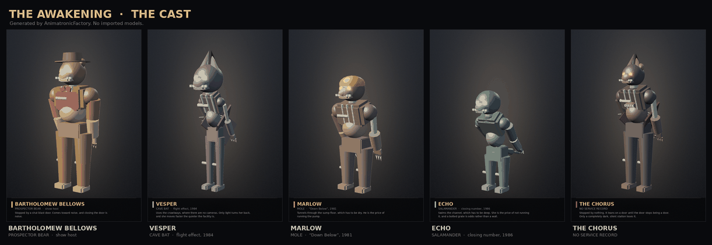

# The Awakening

An original survival-horror night-shift game for **Unity 6**, set in three
decommissioned industrial sites.

You are a reclamation site monitor. You work 11 PM to 6 AM in a control room you never
leave. Everything you can do is a switch on the desk, and every switch costs you
something somewhere else.



*The five characters, rendered straight from `AnimatronicFactory` — the same code the
game runs, ported to a software rasteriser so the models can be looked at without
opening Unity. See [Rendering the cast](#rendering-the-cast).*

---

## What this repository is

A complete, documented **framework** — roughly 24,000 lines of C# across eleven
assemblies, five URP shaders, an editor toolchain and an edit-mode test suite — that
builds a playable game from one menu item.

**It has not been opened in Unity.** It was written in a headless Linux container with
no Unity installation and no compiler, so while every file is checked for structural
correctness by `Tools/validate_project.py` (a C#-aware scanner that understands
comments, verbatim and interpolated strings, and nested literals), **nothing here has
been compiled or run.** Expect to fix some things on first import. See
[Known limitations](#known-limitations) for the specific risks and where to look.

### What it is not

This is **not** a Five Nights at Freddy's game and ships no FNAF content. It borrows
the genre's structural ideas — a stationary night shift, resource attrition, scheduled
AI aggression, a surveillance loop — and none of its characters, models, audio,
likenesses or trademarks. *Five Nights at Freddy's* is Scott Cawthon's trademark; this
project is unaffiliated. Please do not add ripped FNAF assets to it.

---

## Quick start

1. Open the project in **Unity 6** (6000.0 LTS or newer). Let it import; first import
   takes a few minutes while URP compiles.
2. **Tools → Grotto → Build Facility Scene**. This builds the render pipeline, writes
   the settings assets and constructs the playable scene, in that order.
3. Press **Play**. You land on the title screen.

The site generates on load and takes about a second. There is nothing to import and no
art to download — every surface and every sound is produced at runtime.

> If anything looks wrong, **Tools → Grotto → Validate Project** will say what is
> missing. **Tools → Grotto → Rebuild Render Pipeline** creates the three URP tiers on
> its own if you only want that part.

> **Optional:** *Tools → Grotto → Asset Fetcher* pulls curated CC0 texture sets that
> replace the generated ones by name, with no code change. See
> [docs/ASSETS.md](docs/ASSETS.md).

---

## The game

### Three resources, and no safe setting for any of them

The entire design is one idea: **every defence is also an invitation.**

| Resource | What it buys you | What it costs you |
|---|---|---|
| **Power** | Blast doors, the grate, floodlights, the cameras | A diesel genset with a finite day tank, and a breaker whose trip *releases both doors* |
| **Air** | Clear vision, trustworthy cameras | The fan is the loudest thing in the building |
| **Water** | Draining keeps the channel shut | Draining also dries the sump, and something digs |

Power is not a percentage bar. It is an 8kW Lister with a load-dependent burn rate, a
day tank, a limited number of jerry cans and a starter motor that can be heard from the
Grand Gallery. Exceed the continuous rating and a timer starts; let it run out and the
breaker opens, which drops the hold magnets on both blast doors. Resetting it means
holding a lever for four and a half seconds with the monitor down.

Water is the spine. **There is no level at which both threats are shut out** — this is
asserted by a test, not merely intended:

```
0.00 ─────────── 0.35 ────── 0.50 ── 0.55 ─────────────── 1.00
     Marlow digs      │  Marlow in   │      Echo swims      │
     through the      │  the basin   │      the channel     │
     sump floor       │  but stuck   │                      │
                      │              │              CONTROL ROOM
                 DIG line                              FLOODS
                                  SWIM line
```

Run the pump and Marlow has a road. Stop it and Echo does. The gauge on the station
carries both tick marks, because a dial with invisible edges is not a decision.

### The cast

Five characters, each gated by a **different** system, so your answer to one exposes
you to the next.

| | Character | Route | Stopped by | Signature |
|---|---|---|---|---|
| 🐻 | **Bartholomew "Barty" Bellows** | Show floor → either adit | A shut blast door | Comes toward noise — and closing the door is noise |
| 🦇 | **Vesper** | Karst crawlways → cable chase | Light, and nothing else | Moves *faster when the facility is quiet*, so the fan defends against her |
| 🦫 | **Marlow** | Silt tunnel → sump | A dry sump and bolted grate | Needs the basin drained; he is the price of the pump |
| 🦎 | **Echo** | Styx Channel → sump intake | A shallow channel | Needs it deep; the grate is odds, not a wall |
| ❓ | **The Chorus** | Any of them | Nothing — it leans on a door until the door fails | Tracks running machinery; only a completely dark, silent station loses it |
| 👻 | **Cotton** | — | Clean air | Not real. Bad air makes your *instruments* lie |

Cotton is the answer to a problem most horror games have: once a player learns the
rules, the cameras become a spreadsheet. So the instrument degrades. Let the air go and
a figure appears in a feed that is empty next sweep, a camera corrupts and costs six
seconds to reboot, the geophones report a contact from a gallery with nothing in it.
She cannot kill you. She makes the things that can kill you unreadable.

### Three sites, and they disagree about what the water is for

Every site has the same four ways in and the same five characters. What changes is
where the water sits, how fast it moves, and which of your defences it is currently
taking away. Pick one on the title screen; the second and third unlock as you clear
nights.

| Site | Opens at | Water | Air | The idea |
|---|---|---|---|---|
| **Grotto Springs Family Fun Caverns** *(1979 show cave)* | 45% | ×1.00 | ×1.00 | Balanced. There is a narrow band that shuts out both threats, and holding it is the game |
| **Hollowmere Hydro Station** *(1931, inside a dam)* | 66% | ×1.55 | ×0.85 | The dry routes **close** as the night goes on and the wet ones **open**. The decision is when to stop fighting it |
| **Sablefield Grain Terminal** *(1954 elevator)* | 18% | ×0.75 | ×1.85 | The dial is **inverted**. Every dry route is open by default; closing Marlow's burrow means opening Echo's. And the real clock is the air |

Full node tables, link gates and design notes in [docs/MAP.md](docs/MAP.md).

### The survey, and why you look at a camera

Every other system makes the monitor a cost — it draws power, it makes noise, it parks
your head so you cannot see the doors. A player who works that out ends up staring at a
blank wall with the monitor down, which is correct play and the least interesting
version of the game.

So the survey office releases your fuel allowance in stages. Hold a camera on the room
it asks for and a can's worth of diesel appears in the day tank. It never asks for one
of your four approaches — which is exactly the problem, because filing a reading always
means several seconds looking somewhere that cannot hurt you.

### Night events

A night used to be five systems drifting at fixed rates for six hours. Now the building
does something to you, on a schedule drawn from the night's own seed: an inflow surge, a
brownout that cuts the generator's available rating, a duct fault, a multiplexer fault,
or a tremor from the deep gallery that everything hears.

Each is announced six seconds before it lands. An unannounced event is a tax; an
announced one is a decision.

---

## Controls

| Key | Action |
|---|---|
| `Mouse` | Look (clamped to the room, seated) |
| `Space` | Raise / lower the monitor |
| `Q` `E` | Previous / next camera |
| `A` `D` | North / south blast door |
| `1` `2` `3` | North adit / south adit / cable chase floodlight |
| `F` | Cycle the fan — off, low, purge |
| `P` | Sump pump |
| `G` | Sump grate bolts |
| `L` | Cap lamp |
| `R` *(hold)* | Reset the main breaker — the monitor drops while you hold it |
| `T` / `Y` | Pour a jerry can / crank the generator |
| `Esc` | Pause |
| `` ` `` | Developer console |
| `F3` | Debug overlay |
| `J` | Jumpscare test picker — `←` `→` choose, `Enter` fires |

The title screen sits over a live view of the site you have selected, with a site
picker, a night select carrying that site's own records, a settings screen (audio,
look, accessibility, difficulty, display) and the cast dossiers.

The night opens on a briefing screen with the shift orders and the full control
list. It holds the clock until you dismiss it with `Enter`.

---

## Developer tooling

The brief was to make this workable day to day, so the goal is: **any state the game
can reach on its own, you can reach in one line.**

Debugging a horror game is otherwise miserable. The interesting failures happen at
5 AM on night five with the water at a particular level and two characters in specific
rooms, and playing to that point takes six minutes per attempt. Here it is four lines
and it reproduces exactly:

```
night.seed 12345
night.start 5
night.hour 5
env.water 0.52
ai.move echo SUMP
```

### The console — `` ` ``

Around 45 commands with tab completion, command history and edit-distance typo
suggestions. `help` lists them by category.

```
night.*    start, restart, hour, time, seed, end, info, event, events
survey.*   info, target, file
ai.*       list, level, levels, move, state, freeze, attack
power.*    info, fuel, cans, infinite, trip, kill, restore
env.*      info, air, water, fan, pump, freeze, noise
cam.*      list, select, monitor, repair, always
map.*      nodes, links, path, validate
fx.*       scare, jumpscare, hallucinate, nojumpscares
global     god, show, flags, reset, stats, teleport
```

`map.path DEEP STATION swim` answers "why can't Echo get here" by running the same
traversal rule the AI uses. `ai.list` prints every character's state, node, next roll
timer and current odds.

### The overlay — `F3`

Frame timing with **worst-frame** rather than just the mean (an average hides the
stutter the player actually felt), the full power load breakdown, the live water gate
states, and a cast table showing each character's state, location, next roll and the
exact odds of it succeeding.

### Scene view

`show graph` colours every link by whether it is passable *right now* for a chosen
capability — `show.as swim` — which turns "why is Echo just standing there" into a
glance. `show noise` draws the acoustic field. `show paths` draws live routes.
`teleport` detaches the camera to fly the cave.

The console is available in the editor and in development builds. In a release player
it opens only with `-grotto-devtools`, so QA can reproduce a report on a real build
without shipping the console to players.

Full reference: [docs/DEBUG.md](docs/DEBUG.md).

---

## Architecture

Eleven assemblies with a strictly acyclic dependency graph, so the entire dev tooling
layer can be stripped from a shipping build:

```
                    Grotto.Core
                         │
      ┌──────────────────┼──────────────────┐
      │                  │                  │
 Grotto.Facility    Grotto.Player     (Input System)
      │                  │
 Grotto.Procedural       │
      │                  │
  Grotto.AI ─────────────┤
      │                  │
 Grotto.Audio     Grotto.Rendering
      └────────┬─────────┘
           Grotto.UI
               │
        Grotto.DevTools
               │
         Grotto.Editor
```

Three decisions do most of the work:

**Facility systems are plain classes, not MonoBehaviours.** `FacilityRuntime` owns and
ticks them in one explicit, readable order. Update order stops being an emergent
property of script execution settings, and the whole resource model can be stepped from
a test with no scene at all.

**Animatronic position is discrete.** Characters *are* at a node; transit between nodes
is presentation with a duration. The map, the feeds, the geophones, the console and the
tests therefore all agree on one unambiguous answer to "where is it" — which is exactly
what a game about reading positions off a screen needs. No NavMesh.

**One layout asset drives everything.** The navigation graph, the generated geometry,
the camera placements and the map widget all derive from the same
`FacilityLayout`. Move a room and all four follow. The scene is a *build product*, not
a hand-assembled artefact that drifts out of step with its data.

Details: [docs/ARCHITECTURE.md](docs/ARCHITECTURE.md).

### Nothing binary, anywhere

The repository contains no meshes, no textures, no audio and no prefabs. Every surface
comes from `TextureFactory`, every sound from `ProceduralAudio`, every mesh from
`MeshBuilder`, and the scene file references none of them because generation happens at
load time. A Unity project you can actually read in a pull request.

That constraint turned out to suit the material. The cave is limestone, machinery and
water — exactly the class of surface that ridged noise does well, and exactly the class
of sound that additive synthesis and filtered noise do well. The generator is genuinely
built from a firing fundamental and its harmonics.

---

## Repository layout

```
Assets/
  Game/
    Scripts/
      Core/         Clock, night flow, save, events, session request, debug flags
      Facility/     Power, ventilation, water, noise, survey, night events, the graph
        Sites/      Three code-authored layouts, the authoring verbs, the catalog
      AI/           Director, controller, five behaviours, cast spawner, the phantom
      Procedural/   Mesh builder, cave shaper, fixtures, props, character factory
      Player/       Input, station controller, cap lamp
      Audio/        Synthesis and the mix
      Rendering/    Post FX and atmosphere
      UI/           HUD, monitor, map, geophones, front end, title stage
      DevTools/     Console, overlay, gizmos, free camera, ~50 commands
    Editor/         Scene builder, settings builder, pipeline builder, fetcher, validator
    Shaders/        Triplanar rock, vertex-lit surfaces, water, monitor CRT, overlay
    AssetManifest.json
  Tests/EditMode/   Simulation, navigation, sites, night systems, AI maths, persistence
Tools/
  validate_project.py   C#-aware structural checker, also used by CI
  check_layouts.py      Parses the site layouts and checks them, also used by CI
  render_cast.py        Software rasteriser that renders the generated characters
docs/
  renders/              The images above
```

---

## Tests and CI

```bash
python3 Tools/validate_project.py      # runs anywhere, no Unity needed
```

In Unity: **Window → General → Test Runner → EditMode → Run All**.

The suite covers the things that fail silently:

- **Simulation** — fuel burn under load, breaker trip *and* the door release it causes,
  the suffocation timer, pump cavitation, and that flooding reports exactly once
- **Navigation** — path-finding under each capability, one-way drops, and **that the two
  water gates are mutually exclusive at every level in 0.05 steps**, which is the map's
  central design claim
- **Geometry** — that generated faces point the right way. Winding is the easiest thing
  to get wrong in procedural geometry and the hardest to notice, because a reversed
  face is not obviously wrong, it is *invisible*: an inside-out cavern looks exactly
  like one that failed to generate
- **AI maths** — roll frequency at every level, pressure scaling, seeded determinism,
  and that forked streams stay independent so retuning one character does not reshuffle
  everyone else's rolls
- **Persistence** — round-tripping, unlock rules, the version 1 → 2 migration, and that
  a corrupt profile is quarantined rather than deleted
- **Sites** — properties that must hold for *every* map: no unreachable room at any
  water level, every wired role present, every character placed somewhere that exists,
  every attack node an actual approach, no approach nobody uses, and gates in an order
  that means something. Plus one test asserting the three sites are genuinely different
  rather than one map with three skins
- **Night systems** — that the survey never asks for a room you are already watching,
  that its progress decays rather than resets when you glance at a door, that fuel
  overflow is not credited, that events warn before they land and lift on their own,
  and that both are deterministic for a seed

`Tools/check_layouts.py` parses the authored site layouts straight from the C# and
checks node ids, reachability at every water level, cast placement, approach coverage
and gate ordering — the class of map bug that would otherwise only show up by opening
the editor. It is self-tested against a deliberately broken map.

`Tools/validate_project.py` also cross-checks every `using Grotto.X` against the
owning assembly's references — a real compile error that nothing else can see without
a compiler. It found two while this was being written.

CI runs the structural check on every push with no secrets required. The Unity jobs
activate only when `UNITY_LICENSE` is configured, so a fork is never greeted by a
permanently red build.

---

## Known limitations

Stated plainly, because you will hit them:

- **Nothing has been compiled.** No Unity, no `dotnet`, no `mono` in the authoring
  environment. Structural validation passes; type errors are still possible.
- **`RenderPipelineBuilder` reaches URP's SSAO feature through reflection**, because
  both the type and its settings struct are internal. Every field is set defensively,
  so a rename in a future URP leaves SSAO at its own defaults with a warning rather
  than throwing — but it is the most version-fragile code in the repository.
- **Package versions in `Packages/manifest.json` are best-known, not verified.** If one
  fails to resolve, Package Manager will offer the nearest compatible version.
- **The five shaders are unproven.** They follow URP's own pass structure and include
  correct `ShadowCaster`, `DepthOnly` and `DepthNormals` passes, but a URP HLSL shader
  that has never been through the compiler is a hypothesis. All four degrade gracefully:
  `MaterialLibrary` falls back to URP Lit and the UI falls back to untreated rendering.
- **`AssetManifest.json` download URLs are marked `UNVERIFIED`** where they could not be
  reached — the authoring environment's egress policy blocked every art host. They use
  each source's documented public pattern, and the fetcher reports a clear error and
  offers the source page rather than failing silently.
- **UI uses legacy `Text`, not TextMeshPro**, so a fresh clone renders without first
  importing TMP Essentials through a dialog. Every label goes through
  `UIFactory.Label`, so switching is a change to one method.
- **No lightmapping or occlusion culling is baked.** The cave is lit in real time. On a
  large scene this is the first thing to profile.

## Rendering the cast

The characters are generated by `AnimatronicFactory` and never leave Unity, which makes
them hard to look at while writing them. `Tools/render_cast.py` is a faithful Python
port of that factory driving a small software rasteriser — z-buffer, perspective-correct
barycentrics, depth-derived occlusion, ACES tonemap, separable bloom, supersampling — so
the models can be inspected from a terminal:

```bash
python3 Tools/render_cast.py --out docs/renders           # all five, plus a contact sheet
python3 Tools/render_cast.py --out /tmp --only vesper     # one, in about fifteen seconds
```

It is not a nicety. Rendering found four model bugs that are invisible in the inspector:
eye lamps buried inside the skull, a jaw hanging below the chin, a waistcoat on the
character's back, and an exposed ribcage poking through it.

## Where to take it next

- Bake occlusion culling; the chamber-and-tunnel topology suits it unusually well
- Voice the six phone briefings (the text is in `SettingsAssetBuilder`)
- The custom-night UI: `NightDefinition` and the save format already support it
- A fourth site — `LayoutAuthoring` plus a `SiteCatalog` entry is the whole job

---

## Licence

Code and design documents: **MIT**, see [LICENSE](LICENSE).

Anything fetched by the Asset Fetcher keeps its original author's licence; the tool
writes an `ATTRIBUTION.md` beside whatever it downloads. Read
[docs/ASSETS.md](docs/ASSETS.md) before shipping a build.
